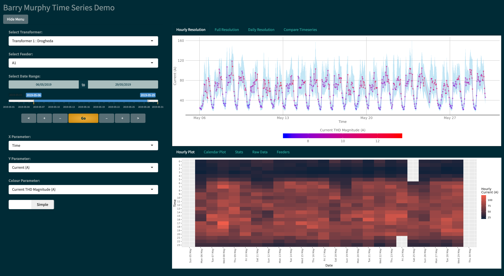
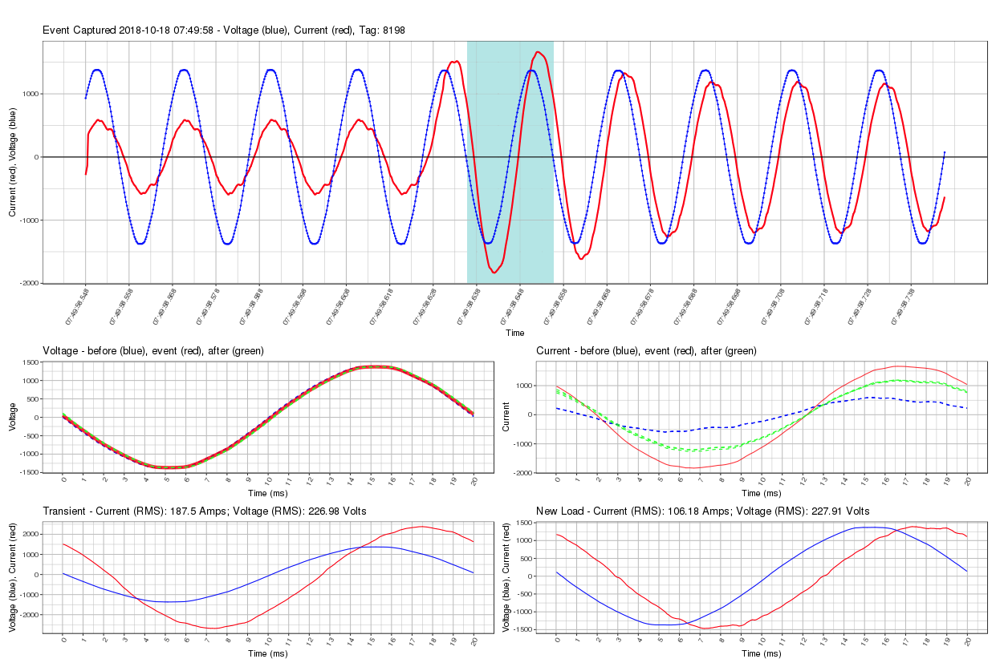

---
## Links

  

  <a href="https://www.linkedin.com/in/barryemurphy"
  class="btn btn-social-icon btn-linkedin" title="LinkedIn">
  
  LinkedIn
  </a> <a href="https://www.linkedin.com/in/barryemurphy">LinkedIn</a> &nbsp;
  

  

  <a href="https://github.com/baztastic"
  class="btn btn-social-icon btn-github" title="Github">
  
  Github
  </a> <a href="https://github.com/baztastic">Github</a> &nbsp;
  

  

  <a href="mailto:barryemurphy3@gmail.com"
  class="btn btn-social-icon btn-google" title="Email">
  
  Email
  </a> <a href="mailto:barryemurphy3@gmail.com">Email</a> &nbsp;
  

  

  <a href="resume"
  class="btn btn-social-icon btn-dropbox" title="Resume">
  
  Resume
  </a> <a href="resume">Resume</a>
  

---
## Featured Projects

<!-- ### UNDER CONSTRUCTION
 -->
Check out some featured past projects below, with more to come soon:

## Interactive time-series data analysis

  

  This tool explores time-series data streaming from custom hardware monitoring power distribution transformers out in the field.

  I wrote it from scratch in **R** using *Shiny* for the web-app elements, and *RPostgreSQL* to handle database requests. Source code is available on [github](https://github.com/baztastic/trafodata).

  The demo connects to a small database with a few weeks' worth of data for two transformers.

  [**Launch**](https://demo.nanobaz.com/shiny/shiny-ui/) the interactive demo.
  

  

### Details:  
  - **Languages**: 
    + R
    + SQL
    + HTML
    + CSS
  - **Modules**: 
    + shiny
    + dplyr
    + ggplot2
    + dygraphs
    + PostgreSQL
  - **Info**: 
    + [Demo](https://demo.nanobaz.com/shiny/shiny-ui/)
    + Developed for  [Electrical Analytics](http://www.electrical-analytics.com/)
    + [Source](https://github.com/baztastic/trafodata)
    + Hosted on  Google Cloud Platform
  

## Event detection, clustering, and cost estimation for electrical power grids

  

  Demo coming soon.

  This technology (currently under patent application) detects electrical events, categorises them, and gives suggestions on reducing cost/energy usage.
  <!-- Click image for interactive demo -->
  

  

### Details:  
  - *Languages*: 
    + R
    + Python
    + SQL
  - *Tools*: 
    + dplyr
    + k-means
    + tensorflow
    + ggplot2
  - *Info*: 
    + Demo Coming Soon
    + Developed for  [Electrical Analytics](http://www.electrical-analytics.com/)
    + Source sealed under patent application
  

<!--   1. Real-time sensor data analysis and UI
  * Languages: Python, C
  * Tools: pyserial, matplotlib
  * Under the hood: [source](https://github.com/baztastic/vreader), [writeup](https://baztastic.github.io/vreader), technology sealed under patent application
  1. Art installation representing data on public bike infrastructure
  * Languages: Python, ActionScript, HTML, CSS
  * Tools: beautifulsoup, matplotlib, Adobe Flash, Photoshop, Mathematica
  * Under the hood: [source](https://github.com/baztastic/dublinbikes)
  1. Quantum mechanical simulation of scanning tunneling microscope
  * Languages: C, LaTeX
  * Tools: first principles model based on Green's functions
  * Under the hood: [source](https://github.com/baztastic/stm), [writeup](https://baztastic.github.io/stm) -->